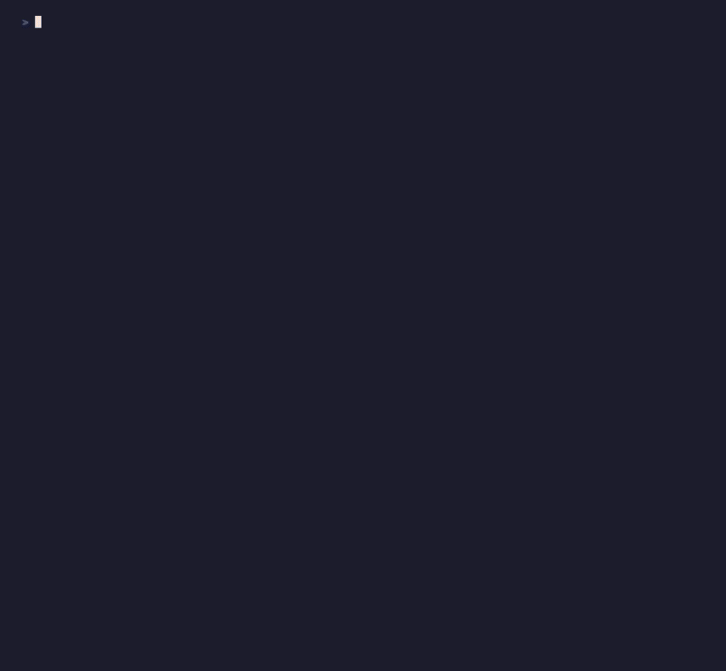

# Agentrace



**How much water did your last coding session use?**

Agentrace reads Claude Code's local session logs and tells you — tokens, cost, cache efficiency, and water footprint. No setup. No API keys. Nothing leaves your machine.

---

## Install

```bash
git clone https://github.com/ryrizo/agentrace.git
cd agentrace
uv tool install --editable .
agentrace water
```

Requires [uv](https://docs.astral.sh/uv/). Zero other dependencies.

---

## Commands

`sessions` · `show` · `stats` · `compare` · `files` · `watch` · `tree` · `recommend` · `diff` · `water` · `report`

```
agentrace help
```

---

## iTerm2 Status Bar

Live token count and cost in your status bar while Claude Code runs.

```bash
bash plugins/install_iterm2.sh
```

See [`plugins/README.md`](plugins/README.md) for setup.

---

*No API keys. No data leaves your machine. Zero dependencies.*
